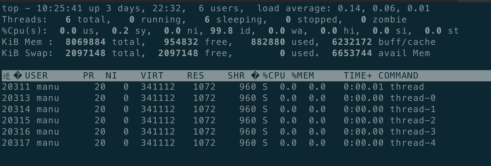

# thread::spawn 

本文介绍Rust中的多线程并发。Rust提供了std::thread::spawn来创建线程。


```rust
use std::thread ;
use std::time::Duration;

fn main()
{
    let handle = thread::spawn(|| {
        for i in 1..10 {
            println!("hi number {} from spawned thread!", i);
            thread::sleep(Duration::from_millis(1));
        }
    });

    for i in 1..5 {
        println!("hi number {} from main thread!", i);
        thread::sleep(Duration::from_millis(1));

    }

    handle.join().unwrap();
}
```

其中thread::spawn的定义如下：

```
pub fn spawn<F, T>(f: F) -> JoinHandle<T> 
where
    F: FnOnce() -> T,
    F: Send + 'static,
    T: Send + 'static, 
```

其返回值是JoinHandle类型。如果操作系统不能创建出来线程，respawn调用会panic。如果你的主程序，需要考虑spawn无法创建出来线程的情况，不能任由程序panic，那么你应该选择本文第三部分介绍的Builder::spawn，该接口会返回Result类型。

输出如下：

```bash
manu-Inspiron-5748 RBE/thread ‹master*› » cargo run
    Finished dev [unoptimized + debuginfo] target(s) in 0.00s
     Running `target/debug/thread`
hi number 1 from main thread!
hi number 1 from spawned thread!
hi number 2 from main thread!
hi number 2 from spawned thread!
hi number 3 from main thread!
hi number 3 from spawned thread!
hi number 4 from main thread!
hi number 4 from spawned thread!
hi number 5 from spawned thread!
hi number 6 from spawned thread!
hi number 7 from spawned thread!
hi number 8 from spawned thread!
hi number 9 from spawned thread!
```

我们使用了join来等待线程退出，由于主进程和线程都有sleep 1毫秒的行为，如果没有主进程调用的join，那么随着主进程的退出，线程也退出了，后面的语句也不会打印出来。

```rust
use std::thread ;
use std::time::Duration;

fn main()
{
    let _handle = thread::spawn(|| {
        for i in 1..10 {
            println!("hi number {} from spawned thread!", i);
            thread::sleep(Duration::from_millis(1));
        }
    });

    for i in 1..5 {
        println!("hi number {} from main thread!", i);
        thread::sleep(Duration::from_millis(1));

    }

    //handle.join().unwrap();
}
```

运行结果如下：

```bash
hi number 1 from main thread!
hi number 1 from spawned thread!
hi number 2 from main thread!
hi number 2 from spawned thread!
hi number 3 from main thread!
hi number 3 from spawned thread!
hi number 4 from spawned thread!
hi number 4 from main thread!
hi number 5 from spawned thread!
```


# join: 等待线程退出

std::thread::spawn 函数的返回类型是JoinHandle， 我们可以在JoinHandle上调用join方法，等待线程退出。

```rust
use std::thread ;
use std::time::Duration;

fn main()
{
    let handle = thread::spawn(|| {
        for i in 1..10 {
            println!("hi number {} from spawned thread!", i);
            thread::sleep(Duration::from_millis(1));
        }
    });

    handle.join().unwrap();

    for i in 1..5 {
        println!("hi number {} from main thread!", i);
        thread::sleep(Duration::from_millis(1));

    }

}
```

上述代码中，主进程会等待线程退出之后，然后打印主进程的信息：

```bash
hi number 1 from spawned thread!
hi number 2 from spawned thread!
hi number 3 from spawned thread!
hi number 4 from spawned thread!
hi number 5 from spawned thread!
hi number 6 from spawned thread!
hi number 7 from spawned thread!
hi number 8 from spawned thread!
hi number 9 from spawned thread!
hi number 1 from main thread!
hi number 2 from main thread!
hi number 3 from main thread!
hi number 4 from main thread!
```

JoinHandle的join函数，原型如下：

```
pub fn join(self) -> Result<T>
```

其返回类型是Result类型。  因此在上面的示例中，我们需要调用unwrap或者expect来处理返回值，如果去除掉unwrap()，就会返回如下的警告：

```
warning: unused `std::result::Result` that must be used
  --> src/main.rs:14:5
   |
14 |     handle.join();
   |     ^^^^^^^^^^^^^^
   |
   = note: `#[warn(unused_must_use)]` on by default
   = note: this `Result` may be an `Err` variant, which should be handled
```

建议主线程总是调用join来检测线程的运行状态，原因如下：

* 如果主线程不等待线程退出，获取线程的返回值，主线程可能较早退出，导致线程也不得不退出，功能失控
* 如果某个线程的工作崩溃，而无论主线程还是其他线程都不做任何处理，程序可能会失控。而主进程通过join，可以获得线程的返回值是Err，从而得知线程崩溃，作出正确的处理决断。

# 定制线程

我们通过std::thread::spawn 可以创建一个线程，而这种线程，一般是典型的线程，线程没有名字，而且线程栈大小为默认的2MB，如果像定制特殊的线程，则需要std::thread::Builder。

目前来讲，有两个参数可以设定：

* name：设定线程的名字
* stack_size： 制定线程的栈大小

```
        let builder = Builder::new().name(thread_name).stack_size(size);
        let child = builder.spawn(move || {
            println!("I am child {}", id);
            thread::sleep(Duration::from_secs(100));
            println!("I am child {}", current().name().unwrap());
        }).unwrap();
```

注意Builder::new之后，还是需要调spawn函数，来唤起线程。

```rust
pub fn spawn<F, T>(self, f: F) -> Result<JoinHandle<T>>
```

主进程为了调用join，需要对Builder::spawn的返回值做unwrap处理，方能调用join函数，否则：

```
error[E0599]: no method named `join` found for enum `std::result::Result<std::thread::JoinHandle<()>, std::io::Error>` in the current scope
  --> src/main.rs:21:15
   |
21 |         child.join().unwrap();
   |               ^^^^ method not found in `std::result::Result<std::thread::JoinHandle<()>, std::io::Error>`

```

整体示例代码如下：

```rust
use std::thread;
use std::thread::{Builder, current} ;
use std::time::Duration;

fn main()
{
    let mut v = vec![];
    for id in 0..5 {
        let thread_name = format!("thread-{}", id);
        let size: usize = 8192 ;
        let builder = Builder::new().name(thread_name).stack_size(size);
        let child = builder.spawn(move || {
            println!("I am child {}", id);
            thread::sleep(Duration::from_secs(100));
            println!("I am child {}", current().name().unwrap());
        }).unwrap();

        v.push(child)
    }
    for child in v{
        child.join().unwrap();
    }

    for i in 1..5 {
        println!("hi number {} from main thread!", i);
        thread::sleep(Duration::from_millis(1));
    }

}
```

输出如下：

```bash
I am child 0
I am child 1
I am child 2
I am child 3
I am child 4
I am child thread-1
I am child thread-3
I am child thread-0
I am child thread-2
I am child thread-4
hi number 1 from main thread!
hi number 2 from main thread!
hi number 3 from main thread!
hi number 4 from main thread!
```

我们通过top -H -p [PID]来查看线程的名字是否生效：




# 使用move闭包

一般来讲，move闭包总是伴随着thread::spawn。我们先看下面的示例：

```rust
use std::thread;

fn main() {
    let v = vec![1, 2, 3];

    let handle = thread::spawn(|| {
        println!("Here's a vector: {:?}", v);
    });

    handle.join().unwrap();
}
```

上述代码执行会出现报错：

```bash
error[E0373]: closure may outlive the current function, but it borrows `v`, which is owned by the current function
 --> src/main.rs:6:32
  |
6 |     let handle = thread::spawn(|| {
  |                                ^^ may outlive borrowed value `v`
7 |         println!("Here's a vector: {:?}", v);
  |                                           - `v` is borrowed here
  |
note: function requires argument type to outlive `'static`
 --> src/main.rs:6:18
  |
6 |       let handle = thread::spawn(|| {
  |  __________________^
7 | |         println!("Here's a vector: {:?}", v);
8 | |     });
  | |______^
help: to force the closure to take ownership of `v` (and any other referenced variables), use the `move` keyword
  |
6 |     let handle = thread::spawn(move || {
  |                                ^^^^^^^

error: aborting due to previous error
```

线程只是要打印v的内容，闭包会尝试borrow v，但是有个致命的问题，即Rust推断不出来，线程要运行多久，以及v这个变量引用是否一直有效。考虑如下场景：

```rust
use std::thread;

fn main() {
    let v = vec![1, 2, 3];

    let handle = thread::spawn(|| {
        println!("Here's a vector: {:?}", v);
    });

    drop(v); // oh no!

    handle.join().unwrap();
}
```

如果Rust允许执行上述代码，新创建的线程，很可能在主线程drop之后，调用println！，这种情况下，v已经失效了。这就不妙了。

通过在闭包之前，添加move关键字，我们会强制闭包获得他需要的值的所有权，而不仅仅是机遇Rust推导来获得值的借用。

修改正确之后的代码如下：

```rust
use std::thread;

fn main() {
    let v = vec![1, 2, 3];

    let handle = thread::spawn( move || {
        println!("Here's a vector: {:?}", v);
    });

    handle.join().unwrap();
}
```

