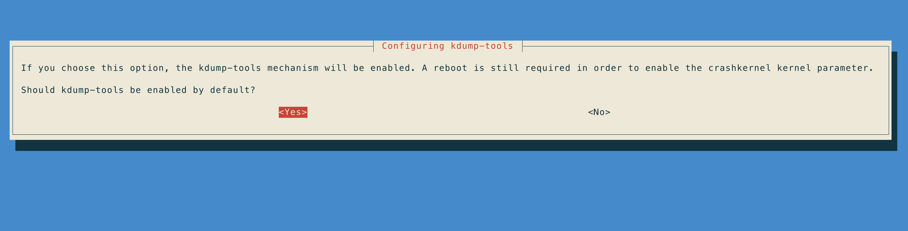
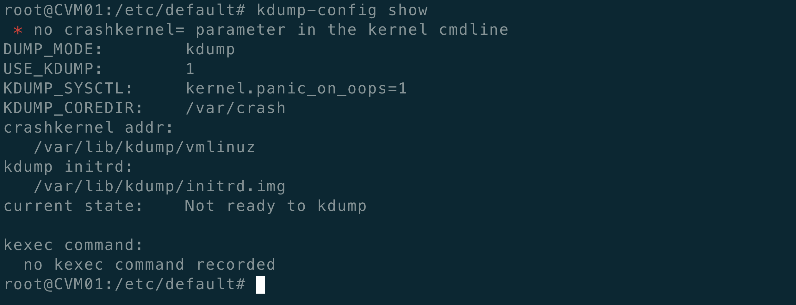

# 前言

有时候需要分配内核crash，我们需要kdump工具，本文介绍Ubuntu 下的相关工具的安装。

kdump功能主要分为3部分：

1）kdump使能阶段：安装kdump，然后重启系统生效，系统会预留一段内存作为第二内核和日志存储用；kdump启动会使用kexec命令加载第二内核完毕，等待触发panic启动；

2）系统panic，进入第二内核，内核将出错信息保存在/proc/vmcore提供给用户；

3）日志转储完毕，重启系统，/var/crash分析日志；

# 安装

Ubuntu下，需要安装linux-crashdump：

```bash
apt-get install linux-crashdump
```




安装完成之后，重启之前：



重启之后：

```bash

root@CVM01:/etc/sysctl.d# kdump-config show
DUMP_MODE:        kdump
USE_KDUMP:        1
KDUMP_SYSCTL:     kernel.panic_on_oops=1
KDUMP_COREDIR:    /var/crash
crashkernel addr: 0x2a000000
   /var/lib/kdump/vmlinuz: symbolic link to /boot/vmlinuz-4.14.148-server
kdump initrd:
   /var/lib/kdump/initrd.img: symbolic link to /var/lib/kdump/initrd.img-4.14.148-server
current state:    ready to kdump

kexec command:
  /sbin/kexec -p --command-line="BOOT_IMAGE=/boot/vmlinuz-4.14.148-server root=UUID=ba73a2b3-f5a0-4035-8689-3494a5aeab16 ro video=VGA-1:800x600 quiet i915.modeset=0 nomodeset net.ifnames=1 biosdevname=0  systemd.unit=kdump-tools-dump.service irqpoll nousb ata_piix.prefer_ms_hyperv=0" --initrd=/var/lib/kdump/initrd.img /var/lib/kdump/vmlinuz

```


如果配置要修改，可以通过如下两种方式来进行：

1. dpkg-reconfigure kexec-tools 和dpkg-reconfigure kdump-tools
2. 修改/etc/default/kexec配置文件

# 参考文献：

[Kernel Crash Dump](https://ubuntu.com/server/docs/kernel-crash-dump)

