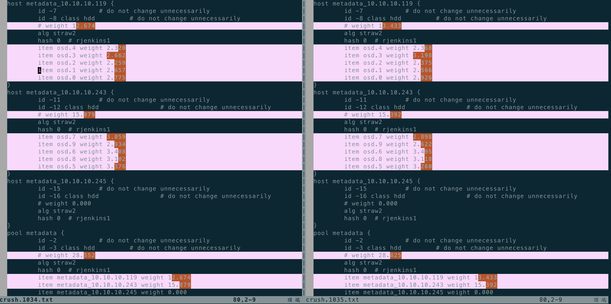

# 前言

开发功能过程中，有遇到crushmap被改坏的情况：

```shell
2021-02-26 16:58:13.362710 mon.lmuoc mon.0 10.10.10.119:6789/0 2658547 : cluster [DBG] osdmap e1033: 10 total, 10 up, 10 in
2021-02-26 16:58:14.418809 mon.lmuoc mon.0 10.10.10.119:6789/0 2658853 : cluster [DBG] osdmap e1034: 10 total, 10 up, 10 in
2021-02-26 16:58:06.359967 mgr.lmuoc client.4097 10.10.10.119:0/854553116 16170 : cluster [DBG] pgmap v6705: 7168 pgs: 7168 active+clean; 87.2GiB data, 180GiB used, 36.0TiB / 36.2TiB avail; 12.3KiB/s rd, 505B/s wr, 15op/s; 10.5MiB/s, 2objects/s recovering
2021-02-26 16:58:08.388416 mgr.lmuoc client.4097 10.10.10.119:0/854553116 16174 : cluster [DBG] pgmap v6706: 7168 pgs: 7168 active+clean; 87.2GiB data, 180GiB used, 36.0TiB / 36.2TiB avail; 16.7KiB/s rd, 589B/s wr, 21op/s; 4.60MiB/s, 1objects/s recovering
2021-02-26 16:58:10.411606 mgr.lmuoc client.4097 10.10.10.119:0/854553116 16175 : cluster [DBG] pgmap v6707: 7168 pgs: 7168 active+clean; 87.2GiB data, 180GiB used, 36.0TiB / 36.2TiB avail; 15.6KiB/s rd, 589B/s wr, 18op/s; 4.60MiB/s, 1objects/s recovering
2021-02-26 16:58:12.440488 mgr.lmuoc client.4097 10.10.10.119:0/854553116 16179 : cluster [DBG] pgmap v6708: 7168 pgs: 7168 active+clean; 87.2GiB data, 180GiB used, 36.0TiB / 36.2TiB avail; 9.45KiB/s rd, 336B/s wr, 12op/s; 4.60MiB/s, 1objects/s recovering
2021-02-26 16:58:14.454427 mgr.lmuoc client.4097 10.10.10.119:0/854553116 16181 : cluster [DBG] pgmap v6711: 7168 pgs: 17 peering, 7151 active+clean; 87.2GiB data, 180GiB used, 36.0TiB / 36.2TiB avail; 19.7KiB/s rd, 505B/s wr, 24op/s
2021-02-26 16:58:15.399887 mon.lmuoc mon.0 10.10.10.119:6789/0 2659056 : cluster [WRN] Health check failed: Reduced data availability: 2 pgs inactive, 17 pgs peering (PG_AVAILABILITY)
2021-02-26 16:58:21.342312 mon.lmuoc mon.0 10.10.10.119:6789/0 2660571 : cluster [INF] Health check cleared: PG_AVAILABILITY (was: Reduced data availability: 3 pgs inactive, 18 pgs peering)
2021-02-26 16:58:21.342357 mon.lmuoc mon.0 10.10.10.119:6789/0 2660572 : cluster [INF] Cluster is now healthy
2021-02-26 16:58:23.065699 mon.lmuoc mon.0 10.10.10.119:6789/0 2660963 : cluster [DBG] osdmap e1035: 10 total, 10 up, 10 in
2021-02-26 16:58:24.139954 mon.lmuoc mon.0 10.10.10.119:6789/0 2661276 : cluster [DBG] osdmap e1036: 10 total, 10 up, 10 in
```

在修改crush过程中，只有4个版本的osdmap变化，如何从osdmap中提取出crush，以及判断crush是从那个版本开始被改坏的呢？


# 获取指定版本的osdmap

```bash
ceph osd getmap 1034 -o osdmap.1034
```

# 从osdmap获得crush

```bash
osdmaptool osdmap.1034 --export-crush crush.1034
crushtool -d crush.1034 -o crush.1034.txt
```

获得crush之后，可以比较两个版本之间，crush的变化：



我们发现，我们关心的metadata的权重，在1035这个osdmap epoch被篡改了。

# 从osdmap获得某个Pool的PG分布

```bash
osdmaptool osdmap.1034  --test-map-pgs-dump --pool 10
```

其输出大约为：

```
。。。
10.3f6	[6,3]	6
10.3f7	[0,8]	0
10.3f8	[5,4]	5
10.3f9	[6,0]	6
10.3fa	[9,0]	9
10.3fb	[6,4]	6
10.3fc	[6,0]	6
10.3fd	[6,2]	6
10.3fe	[5,0]	5
10.3ff	[5,3]	5
#osd	count	first	primary	c wt	wt
osd.0	212	102	102	3.60291	1
osd.1	181	83	83	3.60291	1
osd.2	203	97	97	3.60291	1
osd.3	233	112	112	3.60291	1
osd.4	195	103	103	3.60291	1
osd.5	202	97	97	3.63974	1
osd.6	224	124	124	3.63974	1
osd.7	201	99	99	3.63974	1
osd.8	212	99	99	3.63974	1
osd.9	185	108	108	3.63974	1
 in 10
 avg 204 stddev 15.3428 (0.0752096x) (expected 13.5765 0.0665512x))
 min osd.1 181
 max osd.3 233
size 0	0
size 1	0
size 2	1024
size 3	0
```

我们可以看到PG在OSD上的分布是否均匀，以及各个PG各自分布在那个OSD上。
