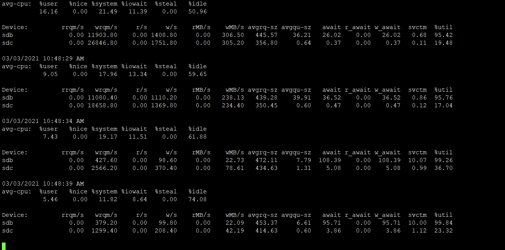

# 前言

当我们的IO密集型的应用怀疑设备的IO抖动，比如说某个磁盘的性能衰退，导致性能问题。这种故障一般需要有故障的硬盘才能测试。但是如何使用正常的硬盘模拟出块设备有较大的延迟呢？

阿里的褚霸有一篇文章[《巧用Systemtap注入延迟模拟IO设备抖动》](http://blog.yufeng.info/archives/2935)，使用SystemTap来模拟故障的设备。

```bash
global inject, ka_cnt

probe procfs("cnt").read {
  $value = sprintf("%d\n", ka_cnt);
}
probe procfs("inject").write {
  inject= $value;
  printf("inject count %d, ka %s", ka_cnt, inject);
}

probe vfs.read.return,
      vfs.write.return {
  if ($return &&
      devname == @1 &&
      inject == "on\n")
  {
    ka_cnt++;
    udelay($2);
  }
}

probe begin{
  println("ik module begin:)");
}

$ stap -V
Systemtap translator/driver (version 2.1/0.152, commit release-2.0-385-gab733d5)
Copyright (C) 2005-2013 Red Hat, Inc. and others
This is free software; see the source for copying conditions.
enabled features: LIBSQLITE3 NSS BOOST_SHARED_PTR TR1_UNORDERED_MAP NLS

$ sudo stap -p4 -DMAXSKIPPED=9999 -m ik -g inject_ka.stp sda6 300
ik.ko
```

但是霸爷的中心在vfs层注入延迟，如果我们关心块设备层，希望能够模拟出来块设备层的较高延迟，那么怎么做呢？

不啰嗦，直接进入主题。

# 在块设备层注入延迟

```bash
global cnt = 0 ;
probe module("sd_mod").function("sd_init_command") !,
      kernel.function("sd_init_command")
{
    device = kernel_string(@choose_defined($cmd, $SCpnt)->request->rq_disk->disk_name)
    if(device == @1)
    {
        mdelay($2);
        if(cnt % 100 == 0)
        { 
             printf("%s inject delay %4d times %7d\n", device,$2, cnt)
        }
        cnt++ ;
    }
    #printf("device %s sd_init_command\n", device);
}

probe begin{
  println("inject_scsi_delay module begin");
}
```


上述文件命名为inject_ka.stp，那么通过如下指令，可以给sdb设备注入10ms的延迟：

```
stap -p4 -DMAXSKIPPED=99999999 -m ik -g inject_ka.stp sdb 10
staprun ik.ko
```

或者执行：

```
stap -g -DMAXSKIPPED=99999999 inject_ka.stp sdb 10
```

我们可以通过iostat查看效果：



# 参考文献

[**https://sourceware.org/systemtap/examples/io/iostat-scsi.stp**](https://sourceware.org/systemtap/examples/io/iostat-scsi.stp)

[**https://sourceware.org/systemtap/examples/io/iostat-scsi.txt**](https://sourceware.org/systemtap/examples/io/iostat-scsi.txt)
