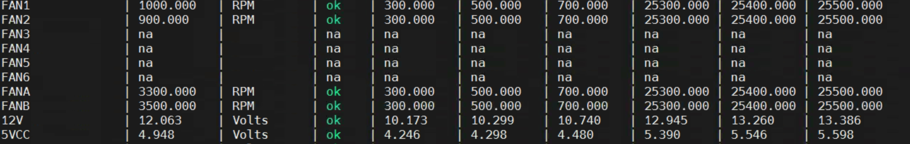

# 前言

本文讨论RAID卡温度以及潜在的影响。

# 查看RAID卡的温度

```
root@scanode1s:~# storcli64 /c0 show all |grep -i temp
Support Temperature = Yes
Temperature Sensor for ROC = Present
Temperature Sensor for Controller = Absent
ROC temperature(Degree Celsius) = 54
Model  State   Temp Mode MfgDate    Next Learn
root@scanode1s:~#
```

其中ROC temperature 即是我们需要关心的温度。一般来讲，该温度的合理值55摄氏度附近。目前空调状态不太好的机房，可能也会涨到60～80摄氏度。

如果R OC Temperature温度超过105摄氏度，从RAID卡的角度，你就会看到如下类似的日志：

```
WARNING:Controller temperature threshold exceeded. This may indicate inadequate system cooling, switch to low performace mode.
```

这种比较可怕，可能会出现大面积掉盘的情况。我们曾遇到客户，冬季客户主动把机房的空调关掉了，结果很快就有盘从RAID组中离线，RAID变成Degrade的情况。

因此，对于一个服务器而言，实时监控RAID卡的散热情况，也是非常重要的。

# 影响RAID温度的要素

RAID卡温度的要素，无非有如下几个要素

* 机房温度
* 风扇转速
* 磁盘业务压力
* RAID组内的一致性检查等带来磁盘I/O的行为

注意，计算机房温度高，风扇有问题等问题存在，但是如果没有任何磁盘I/O基本上也不会导致RAID温度过好。我们遇到的多次RAID卡温度过高，都是糟糕的散热条件，遇到了较高的业务压力，又碰上了一致性检查，多个条件一起作用，终于RAID卡温度飙高不下。

如果发现机房的散热条件不好，或者机器老化等要素，可以针对性地调整一致性检查的速度和模式

* 调整一致性检查的模式从ModeConc改成ModeSeq，串型模式
* 调整CCRate从默认的30，调整成15 
* 一致性检查的时间，可以调整成夜间12点这种业务和温度比较低的时间。

#  风扇转速

我们以超微主板为例，风扇有相关的运行模式 Fan Mode：

* Standard Speed
* Full Speed
* Optimal Speed
* HeavyIO Speed

风扇按照控制区域来分，分成两类：

* CPU or  system Fans，一般被标记成 FAN0 FAN1 FAN2 ，命名方式为FAN+数字，这部分为Zone 0

* Peripheral zone Fans， 一般被命名为FANA FANB FANC，明明方式为FAN+字母，这部分为Zone 1

  

* 

上面提到的四种模式：

* Standard： BMC 同时控制两个zone， with CPU Zone base CPU temp（target speed 50%），and Peripheral zone based on PCH temp （with target speed 50%）
* Optimal： BMC Control of the CPU zone （target speed 30%），with Peripheral zone fixed at low speed （fixed ～30%）
* Full： all Fans running at 100%
* HeavyIO ： BMC control both CPU zone （target speed 50%） and Peripheral zone fixed at 75%

如果像存储服务器这种，Optimal肯定是不合适了，Full的话也不太合适，因为太吵，可选的就是两个，Standard和HeavyIO。如果保守起见，可以选择Heavy IO，防止散热不好的情况下，RA ID卡温度过高。

# 如何调整风扇转速和模式

## 调整风扇模式

我们以全速模式为例，如何讲风扇调整为全速模式：

```
ipmitool 0x30 0x45 0x01 0x01
```

注意倒数第二个0x01表示的是Zone：

* 0x00 表示的是zone 0，   即负责CPU zone的风扇
* 0x01 表示的是zone 1

最后一个0x01 表示的是模式：

* standard ：0
* Full：       1
* Optimal： 2
* HeavyIO：4

我们故意做个测试，来看下将风扇模式调整成Full的效果：


调整成Full模式之后，很快的时间内温度就下降下来了。

## 调整转速

Full模式虽然开心，效果明显，但是很明显噪音很大。所以100%的风扇转速虽然爽，但是忍受不了噪音。那如何处理？

```bash
ipmitool raw 0x30 0x70 0x66 0x01 0x<z> 0x<n>
```

z的合法值为0 和1 ，其中0表示Zone 0， 1 表示Zone 1.

n的合法值是从0x00 到0x64 ，即从0%到100%。

比如说我们觉得Full模式的100%太吵，Heavy IO模式的75%效果虽然不错，但是也太吵，我们可以将Zone1的百分比调整成60%。

```
 ipmitool raw 0x30 0x70 0x66 0x01 0x1 0x3C 
```


# 总结

下面总结是对于存储服务器而言的，并非针对所有应用场景

* RAID卡的温度要实时监测，确保运行稳定
* 风扇模式有4种，Full和Optimal都不可取，Standard和Heavy IO可以选择
* 对于转速不满意的，可以通过ipmitool 指令调节转速，使其在合理范围内调节。

