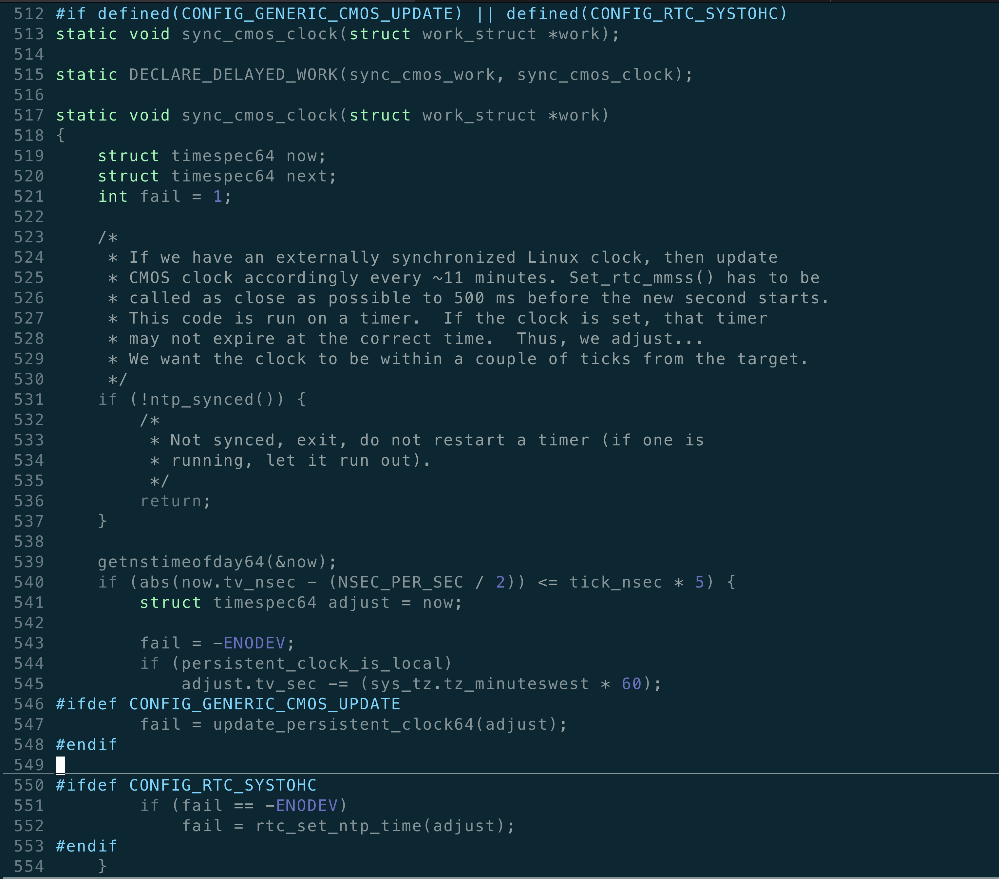

# 如何查看当前当前NTP状态
## ntpstat

```
>> NODE: 20.20.20.222 <<
synchronised to local net at stratum 11
   time correct to within 10 ms
   polling server every 16 s

>> NODE: 20.20.20.223 <<
synchronised to NTP server (20.20.20.222) at stratum 12
   time correct to within 12 ms
   polling server every 16 s
   
>> NODE: 20.20.20.224 <<
synchronised to NTP server (20.20.20.222) at stratum 12
   time correct to within 11 ms
   polling server every 16 s

>> NODE: 20.20.20.226 <<
synchronised to NTP server (20.20.20.222) at stratum 12
   time correct to within 12 ms
   polling server every 16 s

>> NODE: 20.20.20.227 <<
synchronised to NTP server (20.20.20.222) at stratum 12
   time correct to within 12 ms
   polling server every 16 s
```
首先第一行NTP Server反应了当前机器的NTP Server IP。
第二行反应了时间的偏差。
第三行表示同步的时间频率。

```
root@n82-2:~# cat /etc/ntp.conf
...
server 20.20.20.222 burst iburst minpoll 4 maxpoll 4
...
```

为什么是每16秒查询一次？
poll 的含义是how frequently to query server (in seconds)， 4的含义是2的4次方，即每16秒查询一次。

除了正常的上述情况外，还有：

```
>> NODE: 20.20.20.222 <<
unsynchronised
   polling server every 8 s

>> NODE: 20.20.20.223 <<
unsynchronised
   polling server every 8 s

>> NODE: 20.20.20.224 <<
unsynchronised
   polling server every 8 s
```
上述情况出现在，刚刚重启ntpd，尚未同步的阶段。

## ntpq -p

```
root@n82-1:/var/log# ntpq -pn
     remote           refid      st t when poll reach   delay   offset  jitter
==============================================================================
 20.20.20.224    20.20.20.222    12 s   13   16  376    0.142   -0.010   0.202
 20.20.20.226    20.20.20.222    12 s    1   16  377    0.114   -0.003   0.076
 20.20.20.227    20.20.20.222    12 s    1   16  377    0.150   -0.021   0.020
 20.20.20.223    20.20.20.222    12 s    4   16  377    0.136   -0.013  18.163
*127.127.1.0     .LOCL.          10 l   10   16  377    0.000    0.000   0.000
root@n82-1:/var/log#
```
remote和refid，表明的本机器的远端NTP Server和该远端Server的上级 NTP Server

remote and refid : remote NTP server, and its NTP server

按照我们的NTP部署，如果没有外部的NTP服务器，我们会选择 ceph-mon leader节点，作为内部集群的NTP Server。对于我们本集群而言：

```
root@n82-1:/var/log# ceph mon dump
dumped monmap epoch 5
epoch 5
fsid bd489dd6-57c1-4878-a279-739624997f24
last_changed 2022-06-09 15:48:42.559018
created 2022-06-09 15:47:51.033044
0: 20.20.20.222:6789/0 mon.mvdfp
1: 20.20.20.223:6789/0 mon.fciae
2: 20.20.20.224:6789/0 mon.vmlcw
3: 20.20.20.226:6789/0 mon.qcdnb
4: 20.20.20.227:6789/0 mon.abtdv
```
20.20.20.222节点是IP最小的ceph-mon，正常情况下，整个集群的NTP Server 20.20.20.222。

可是，为什么在20.20.20.222节点上，执行ntpq -pn指令，remote这一列，会列出来其他存储节点的IP？

这就不得不提 peer参数了。 

```
peer 20.20.20.224 burst iburst minpoll 4 maxpoll 4

```

peer中出现的IP和 server 指定的IP，都出现在ntpq -pn的remote列，why？这两者有什么区别？

```
ntpd service requests the time from another server
ntpd service exchanges the time with a fellow peer
```
NTP Server 是有层级的概念的，即配置文件中的：

```
server 127.127.1.0 burst iburst minpoll 4 maxpoll 4
fudge 127.127.1.0 stratum 10
```
stratum 这个值越低，表示越权威。127.127.1.0 表示local本机作为NTP Server，层级一般定为10。
我们看一个集群内的普通节点：

```
root@n82-2:~# ntpq -pn
     remote           refid      st t when poll reach   delay   offset  jitter
==============================================================================
+20.20.20.224    20.20.20.222    12 s    8   16  376    0.163   -0.008   0.562
+20.20.20.226    20.20.20.222    12 s    7   16  377    0.172    0.046   0.074
+20.20.20.227    20.20.20.222    12 s    8   16  377    0.144    0.006   0.167
+20.20.20.222    LOCAL(0)        11 s    1   16  377    0.104   -0.018   0.122
*20.20.20.222    LOCAL(0)        11 u    6   16  377    0.090    0.014   0.584
```
可以看到20.20.20.222 stratum 层级为11 ，而 出现在peer中的，层级为 12 。

下面介绍下ntpq 各个字段的含义：
poll: 这一行，表示周期，即查询周期，前面介绍了 minpoll 4 maxpoll 4 即16秒查询一次。
when： 这一行表示，距离上一次查询的时间。
reach：这个是个8进制的表示：

	*	377 = 0b1111111， 表示最近8次查询都成功了
	*   376 = 0b11111110 除了最近一次查询失败外，其他7次查询都成功了。
	*   257 = 0b10101111 表示，最近的4次都成功了，以最近一次为开始算起，第五次和第七次查询失败了

dalay：  network round trip time (in milliseconds) 这个是估算的和对应NTP Server（或者peer）之间的网络延迟。因为是虚拟机，所以延迟是0.1ms以上。
offset： 本机与remote NTP Server （or peer）的时间差异，我看文档已里面写的单位是ms，但是我自己判断单位是秒。
jitter: 这个是抖动的含义，比较高的抖动，表示要么是remote Server不够稳定精准，或者是网络条件太差。
 
* jitter： difference of successive time values from server (high jitter could be due to an unstable clock or, more likely, poor network performance)


# 如何校验某个NTP Server是否可用

我们可以通过ntpdate -d指令来校验，他用来诊断，但是并不会更改本地的时间。

 ```
       -d     Enable  the  debugging  mode,  in which ntpdate will go through all the steps, but not adjust the local clock. Information useful for general debugging will also be printed.
 ```

如果NTP Server网络可达，并且可以响应我们的查询，输入如下：

```
root@n82-1:/home/btadmin# ntpdate -d 20.20.20.223
25 Jun 15:24:50 ntpdate[919323]: ntpdate 4.2.8p4@1.3265-o Tue Jan  7 15:08:24 UTC 2020 (1)
Looking for host 20.20.20.223 and service ntp
host found : 20.20.20.223
transmit(20.20.20.223)
receive(20.20.20.223)
transmit(20.20.20.223)
receive(20.20.20.223)
transmit(20.20.20.223)
receive(20.20.20.223)
transmit(20.20.20.223)
receive(20.20.20.223)
server 20.20.20.223, port 123
stratum 11, precision -24, leap 00, trust 000
refid [20.20.20.223], delay 0.02576, dispersion 0.00005
transmitted 4, in filter 4
reference time:    e66136bf.6e4bc565  Sat, Jun 25 2022 15:24:47.430
originate timestamp: e66136c9.1d79f7d3  Sat, Jun 25 2022 15:24:57.115
transmit timestamp:  e66136c9.1d70de0a  Sat, Jun 25 2022 15:24:57.115
filter delay:  0.02602  0.02638  0.02591  0.02576
         0.00000  0.00000  0.00000  0.00000
filter offset: -0.00006 -0.00026 0.000019 -0.00001
         0.000000 0.000000 0.000000 0.000000
delay 0.02576, dispersion 0.00005
offset -0.000011

25 Jun 15:24:57 ntpdate[919323]: adjust time server 20.20.20.223 offset -0.000011 sec
root@n82-1:/home/btadmin# echo $?
0
```

如果网络不可达，或者不能响应查询的请求：

```
root@n82-1:/home/btadmin# ntpdate -d 20.20.20.222
25 Jun 15:28:20 ntpdate[931881]: ntpdate 4.2.8p4@1.3265-o Tue Jan  7 15:08:24 UTC 2020 (1)
Looking for host 20.20.20.222 and service ntp
host found : 20.20.20.222
transmit(20.20.20.222)
transmit(20.20.20.222)
transmit(20.20.20.222)
transmit(20.20.20.222)
transmit(20.20.20.222)
20.20.20.222: Server dropped: no data
server 20.20.20.222, port 123
stratum 0, precision 0, leap 00, trust 000
refid [20.20.20.222], delay 0.00000, dispersion 64.00000
transmitted 4, in filter 4
reference time:    00000000.00000000  Thu, Feb  7 2036 14:28:16.000
originate timestamp: 00000000.00000000  Thu, Feb  7 2036 14:28:16.000
transmit timestamp:  e661379f.36a98426  Sat, Jun 25 2022 15:28:31.213
filter delay:  0.00000  0.00000  0.00000  0.00000
         0.00000  0.00000  0.00000  0.00000
filter offset: 0.000000 0.000000 0.000000 0.000000
         0.000000 0.000000 0.000000 0.000000
delay 0.00000, dispersion 64.00000
offset 0.000000

25 Jun 15:28:33 ntpdate[931881]: no server suitable for synchronization found
root@n82-1:/home/btadmin# echo $?
1
```

# NTP和hwclock

最后一个话题就是NTP 与hardware clock了。硬件时钟和系统时钟到底啥关系，NTP会在其中发挥什么样的影响。

Linux层面有两个时钟：

* 	system clock
*   hardware clock 

hwclock manual中，有如下一段话：

```
Automatic Hardware Clock Synchronization by the Kernel
       You should be aware of another way that the Hardware Clock is kept synchronized in some systems.  The Linux kernel has a mode wherein it copies  the System  Time  to  the  Hardware Clock every 11 minutes. This mode is a compile time option, so not all kernels will have this capability.  This is a good mode to use when you are using something sophisticated like NTP to keep your System Clock synchronized. (NTP is a way to keep your System  Time synchronized either to a time server somewhere on the network or to a radio clock hooked up to your system.  See RFC 1305.)

       If the kernel is compiled with the '11 minute mode' option it will be active when the kernel's clock discipline is in a synchronized state.  When in this state, bit 6 (the bit that is set in the mask 0x0040) of the kernel's time_status variable is unset. This value is output as the 'status'  line of the adjtimex --print or ntptime commands.

       It  takes  an  outside influence, like the NTP daemon ntpd(1), to put the kernel's clock discipline into a synchronized state, and therefore turn on  '11 minute mode'.  It can be turned off by running anything that sets the System Clock the old fashioned way, including hwclock --hctosys.  However, if the NTP daemon is still running, it will turn '11 minute mode' back on again the next time it synchronizes the System Clock.

       If  your  system runs with '11 minute mode' on, it may need to use either --hctosys or --systz in a startup script, especially if the Hardware Clock is configured to use the local timescale. Unless the kernel is informed of what timescale the Hardware Clock is using, it may clobber  it  with  the wrong one. The kernel uses UTC by default.

       The  first  userspace  command  to  set  the  System  Clock  informs  the  kernel  what timescale the Hardware Clock is using.  This happens via the persistent_clock_is_local kernel variable.  If --hctosys or --systz is the first, it will set this variable according to the  adjtime  file  or  the appropriate command-line argument.  Note that when using this capability and the Hardware Clock timescale configuration is changed, then a reboot is required to notify the kernel.
```
大意是说，如果设置了NTP Server，内核每11分钟会调整硬件时钟，使其向系统时钟看起， 这被成为 11 miniute mode。看不看起，也是有条件的。



内核中有两个相关的配置选项：

* CONFIG_GENERIC_CMOS_UPDATE
* CONFIG_RTC_SYSTOHC

如此外，也要关注NTP的状态，我们可以通过timedatectl查看NTP SYNC 状态：

```
root@SEG-248-82:/home/btadmin# timedatectl
      Local time: Sat 2022-06-25 16:07:59 HKT
  Universal time: Sat 2022-06-25 08:07:59 UTC
        RTC time: Sat 2022-06-25 08:08:00
       Time zone: Asia/Hong_Kong (HKT, +0800)
 Network time on: yes
NTP synchronized: yes
 RTC in local TZ: no
```

如果ntp同步时间有异常，硬件时钟向系统时钟的同步也会受到影响。


