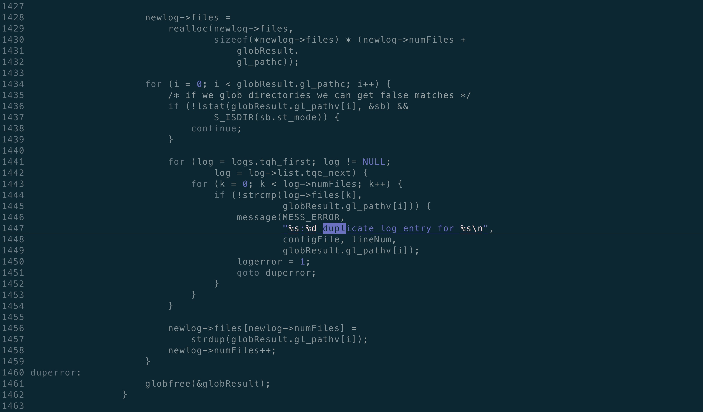

# 前言
最近帮忙处理了/var/log/ceph/下的文件不能rotate的问题，分析了原因，把关于logrotate的相关的知识点梳理了下，特记录为本文。
在合作伙伴的环境里面，因为ceph.audit.log 可能会产生出比较大的文件，ceph相关的rotate配置被改成了这个样子。
```
/var/log/ceph/ceph.audit.log {
    rotate 14
    daily
    maxsize 5G
    compress
    sharedscripts
    postrotate
        killall -q -1 ceph-mon || true
    endscript
    missingok
    notifempty
    su root ceph
}
/var/log/ceph/*.log {
    rotate 7
    daily
    compress
    sharedscripts
    postrotate
        killall -q -1 ceph-mon ceph-mgr ceph-mds ceph-fuse radosgw rbd-mirror || true
        killall -q -1 -r ceph-osd.* || true
    endscript
    missingok
    notifempty
    su root ceph
}
```
合作伙伴报故障，说ceph-osd等日志都没有回滚。

# 如何检查conf文件
logrotate提供了-d选项，可以用来检查conf文件是否有错误。
```
root@node165:/etc/logrotate.d# logrotate --help
Usage: logrotate [OPTION...] <configfile>
  -d, --debug               Don't do anything, just test (implies -v)
  -f, --force               Force file rotation
  -m, --mail=command        Command to send mail (instead of `/usr/bin/mail')
  -s, --state=statefile     Path of state file
  -v, --verbose             Display messages during rotation
      --version             Display version information

Help options:
  -?, --help                Show this help message
      --usage               Display brief usage message

```
我们检查下旧的conf文件：
```
root@node165:/etc/logrotate.d# logrotate -d ceph-common
reading config file ceph-common
error: ceph-common:14 duplicate log entry for /var/log/ceph/ceph.audit.log

Handling 2 logs

rotating pattern: /var/log/ceph/ceph.audit.log  after 1 days (14 rotations)
empty log files are not rotated, log files >= 5368709120 are rotated earlier, old logs are removed
switching euid to 0 and egid to 64045
considering log /var/log/ceph/ceph.audit.log
  log does not need rotating
not running postrotate script, since no logs were rotated
switching euid to 0 and egid to 0

rotating pattern: /var/log/ceph/*.log  after 1 days (7 rotations)
empty log files are not rotated, old logs are removed
No logs found. Rotation not needed.
root@node165:/etc/logrotate.d#
```
上来就检查到了error。根据wildcard的匹配，ceph.audt.log同时匹配第一条的规则和第二条的规则。这种情况下会怎么样呢。



如果发现有重复的话， 本条规则就会放弃，所以/var/log/ceph/*.log 这条规则被放弃，从而，除了ceph.audit.log会正常rotate外，其他的所有日志都不会rotate，只会越变越大，和现场的情况一致。

很有意思的是，如果将两个规则调换下顺序，所有的日志都会rotate，只是ceph.audit.log 按照/var/log/ceph/*.log的规则去rotate，而不是自己的特有规则去rotate。如果文件存在重复，那么后面出现的规则会被抛弃。

# 触发时机

logrotate什么时候会检查？如果满足条件，什么时候会被执行？
```bash
root@node165:/etc/logrotate.d# cat /etc/crontab
# /etc/crontab: system-wide crontab
# Unlike any other crontab you don't have to run the `crontab'
# command to install the new version when you edit this file
# and files in /etc/cron.d. These files also have username fields,
# that none of the other crontabs do.

SHELL=/bin/sh
PATH=/usr/local/sbin:/usr/local/bin:/sbin:/bin:/usr/sbin:/usr/bin

# m h dom mon dow user  command
17 *    * * *   root    cd / && run-parts --report /etc/cron.hourly
25 6    * * *   root    test -x /usr/sbin/anacron || ( cd / && run-parts --report /etc/cron.daily )
47 6    * * 7   root    test -x /usr/sbin/anacron || ( cd / && run-parts --report /etc/cron.weekly )
52 6    1 * *   root    test -x /usr/sbin/anacron || ( cd / && run-parts --report /etc/cron.monthly )
#
root@node165:/etc/logrotate.d#

```
我们看到crontab中有

- hourly
- daily
- weekly
- monthly

四个等级的cron job，其中在/etc/cron.hourly目录下：
```bash
root@node165:/etc/cron.hourly# ll
total 24
drwxr-xr-x   2 root root  4096 Oct 11 14:20 ./
drwxr-xr-x 134 root root 12288 Oct 24 20:35 ../
-rwxr-xr-x   1 root root   372 May  6  2015 logrotate*
-rw-r--r--   1 root root   102 Apr  6  2016 .placeholder
root@node165:/etc/cron.hourly#
root@node165:/etc/cron.hourly# cat logrotate
#!/bin/sh

# Clean non existent log file entries from status file
cd /var/lib/logrotate
test -e status || touch status
head -1 status > status.clean
sed 's/"//g' status | while read logfile date
do
    [ -e "$logfile" ] && echo "\"$logfile\" $date"
done >> status.clean
mv status.clean status

test -x /usr/sbin/logrotate || exit 0
/usr/sbin/logrotate /etc/logrotate.conf
root@node165:/etc/cron.hourly#
```
我们看到每个小时的17分，会执行hourly的任务，其中就有logrotate的相关的任务。所以每个小时的17分，会执行logrotate的相关的任务，logrotate会检查是否满足回滚日志的条件，如果满足的话，会执行相关的命令。

# logrotate状态的记录
如果我要问，某个文件 上一次rotate是什么时间？这个信息如何查找？
```bash
/var/lib/logrotate/status  
```
这个文件记录了logrotate的状态：

```bash
root@node164:/var/lib/logrotate# cat status  |grep ceph
"/var/log/ceph/ceph-osd.4.log" 2022-10-17-0:17:1
"/var/log/ceph/ceph-mds.vigex.log" 2022-10-21-17:0:0
"/var/log/ceph/ceph-mds.wbjal.log" 2022-10-17-15:0:0
"/var/log/ceph/ceph-mon.czlyb.log" 2022-10-17-15:0:0
"/var/log/ceph/ceph-mgr.czlyb.log" 2022-10-21-16:17:1
"/var/log/ceph/ceph-client.radosgw.0.log" 2022-10-17-0:17:1
"/var/log/ceph/ceph-osd.6.log" 2022-10-24-5:17:1
"/var/log/ceph/ceph-mgr.jmsac.log" 2022-10-24-0:17:1
"/var/log/ceph/ceph-mon.jmsac.log" 2022-10-21-16:0:0
"/var/log/ceph/ceph-osd.10.log" 2022-10-22-13:17:1
"/var/log/ceph/ceph-osd.8.log" 2022-10-22-6:17:1
"/var/log/ceph/ceph-osd.1.log" 2022-10-17-0:17:1
"/var/log/ceph/ceph.audit.log" 2022-10-24-14:17:1
"/var/log/ceph/ceph-mds.ywjxq.log" 2022-10-17-16:0:0
"/var/log/ceph/ceph-osd.3.log" 2022-10-17-0:17:1
"/var/log/ceph/ceph-osd.5.log" 2022-10-17-0:17:1
"/var/log/ceph/ceph-osd.7.log" 2022-10-22-6:17:1
"/var/log/ceph/ceph-osd.11.log" 2022-10-22-0:17:1
"/var/log/ceph/ceph-osd.9.log" 2022-10-22-15:17:1
"/var/log/ceph/ceph-osd.0.log" 2022-10-17-0:17:1
"/var/log/ceph/ceph-mon.odkzh.log" 2022-10-17-0:17:1
"/var/log/ceph/ceph-mgr.odkzh.log" 2022-10-18-0:17:1
"/var/log/ceph/ceph.log" 2022-10-24-0:17:1
"/var/log/ceph/ceph-mds.bihnq.log" 2022-10-17-1:17:1
"/var/log/ceph/ceph-osd.2.log" 2022-10-17-0:17:1
```
通过查看这个文件，我们可以了解上次logrotate发生的事件。

# 某些有意义的参数
logrotate的参数很多，有些参数非常有意思：
## daily
这个参数的意思是按天回滚，日志一天存放一个文件，该参数一般和如下参数配合使用：
```bash
rotate 7
daily
compress
```
每天日志回滚一次，最多保留7分，旧的日志会被压缩。这样的话，基本上会保留一周的日志。但是有些时候，一周之前的日志回滚掉，会给排查问题带来很大的麻烦，比如需要查18天前的日志，那么就来不及了，因为日志已经被删除掉了。
## minsize 和maxsize
这两个参数非常有用。logrotate是为了保护磁盘空间，防止日志永不删除，导致系统盘或者日志盘被写满，从而导致异常发生。
但是这个世界的本质就是妥协：

- 一方面，当我们需要通过日志排查问题的时候，我们希望尽可能多的日志存放在磁盘上
- 另一方面，我们又担心存放太多的日志文件会导致系统盘或者日志盘被占满，引发故障
```bash
进退维谷，左右为难
```
除了daily的选项外，logrotate提供了minsize这个非常有用的参数。这个参数是对logrotate一票否定的参数，即要想rotate，至少log的大小要超过minsize，这个参数对那些平时比较静默的日志文件比较友好。如果一个日志文件，平时基本不打印日志，那么纵然设置了daily参数，到了每个小时的17分的时候，依然不会回滚，因为日志的size低于minsize，无需回滚。
minsize就给出了一个潜在的可能，即可能存放超过指定天数（比如7天）的日志量，如果某些日志文件平时不经常打印的情况下，如下所示：
```bash
rotate 7
daily
compress
minsize 50M
maxsize 2G
```
maxsize则提供了另外一层的可能，即一天的事件还未到，就产生了比较大的日志量，单纯靠daily这个参数控制，为时已晚，可能还没等到回滚，日志已经打爆了系统盘或者日志盘。maxsize是一个对logrotate一票决定的参数，即只要log的大小超过maxsize，就会及时回滚。

